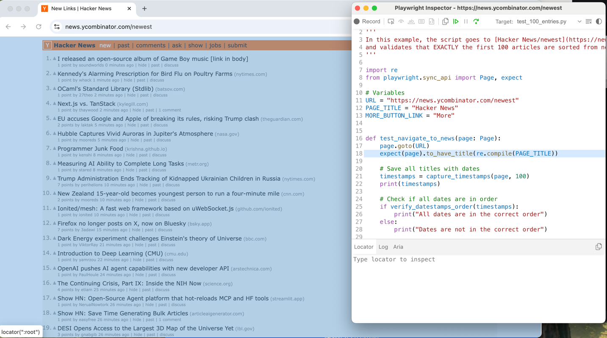

[Playwright](https://playwright.dev/) is a powerful open-source automation tool developed by Microsoft. It's primarily used for end-to-end testing of web applications, and it can be used with many languages. 

This repository provides practical examples using Playwright's [Python](https://github.com/microsoft/playwright-python) implementation.

## How to Setup Playwright

Install the Pytest plugin:
```
pip install pytest-playwright
```

Install the required browsers:
```
playwright install
```

## How to Execute Playwright tests
To run all tests in a headless mode without showing a browser, open a terminal and type:
```
pytest
```

To run all tests in a headed mode, open a terminal and type:
```
pytest --headed
```

To generate reports, install `pip install pytest-html` and use `--html` option while running scripts: 
```
pytest --html=Results/verify.html Tests/test_verify_page_elements.py
```


## Debugging with Playwright Inspector 
To debug a specific test case with the inspector:
```
PWDEBUG=1 pytest -s -k test_case_name
```
You will be able to execute scripts line-by-line, inspect elements, etc:


## Integration with GitHub Actions
This project utilizes GitHub Actions to automatically run all tests with any code updates, with the configuration defined in `.github/workflows/playwright.yml`
